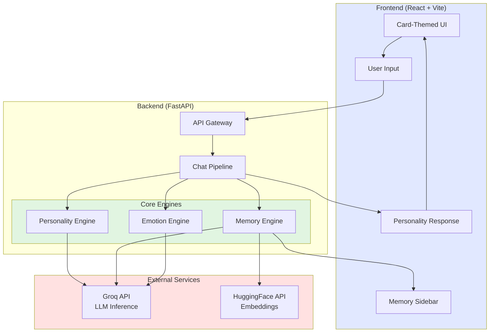
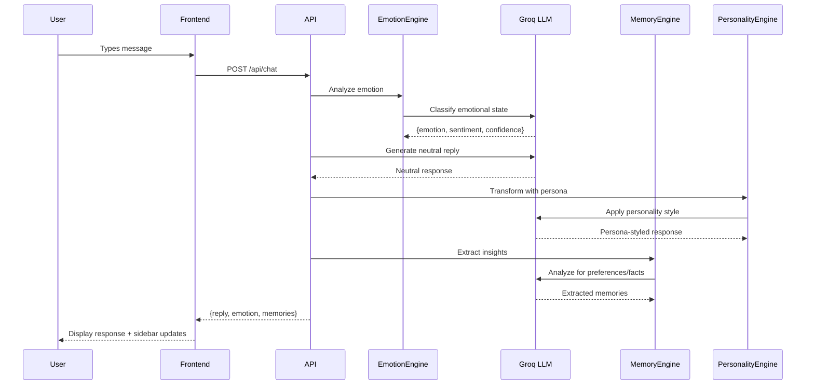
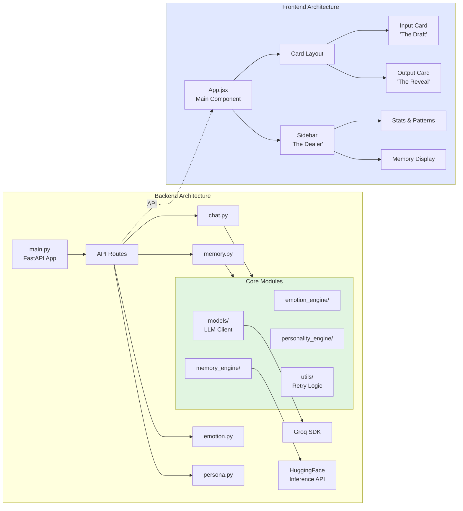

# Koko - The Personality Engine

**An AI companion with memory-enhanced personality transformation**

KOKO is a sophisticated AI system that analyzes your emotional state, maintains a persistent memory of your preferences and patterns, and responds with dynamically adjusted personalities. Built with a card game-themed interface, KOKO delivers empathetic, personalized interactions.

---

## 🎯 Overview

KOKO combines three core AI engines to create a unique conversational experience:

1. **Emotion Engine**: Analyzes emotional state and sentiment using LLM-powered classification
2. **Memory Engine**: Extracts and stores user preferences, emotional patterns, and contextual facts
3. **Personality Engine**: Transforms neutral responses using distinct personas (The Joker, The Gentle Heart, The Strategist, The Philosopher)

### Key Features

- ✨ **Real-time Emotion Analysis**: Detects emotional state, sentiment, and confidence levels
- 🧠 **Persistent Memory**: Remembers user preferences, patterns, and facts across conversations
- 🎭 **Dynamic Personalities**: Four distinct personas with unique communication styles
- 📊 **Visual Analytics**: Emotional pattern tracking and user statistics
- 🎨 **Card Game Aesthetic**: Beautiful card-themed UI with smooth animations
- 🔄 **Memory Visualization**: See extracted facts, preferences, and patterns in real-time

---

## 🏗️ Architecture

### System Overview



### Data Flow



### Component Architecture



---

## 🚀 Quick Start

### Prerequisites

- **Python 3.10+** (for backend)
- **Node.js 18+** (for frontend)
- **Groq API Key** ([Get one here](https://console.groq.com))
- **HuggingFace API Token** (optional, for embeddings)

### 1. Clone the Repository

```bash
git clone <repository-url>
cd koko
```

### 2. Backend Setup

#### a. Create Virtual Environment

```bash
# Windows
python -m venv biens
biens\Scripts\activate

# macOS/Linux
python3 -m venv biens
source biens/bin/activate
```

#### b. Install Dependencies

```bash
cd backend
pip install -r requirements.txt
```

#### c. Configure Environment

Create `backend/.env`:

```env
# Required
GROQ_API_KEY=your_groq_api_key_here

# Optional
HF_API_TOKEN=your_huggingface_token
LLM_MODEL=llama3-8b-8192
EMBEDDING_MODEL=sentence-transformers/all-MiniLM-L6-v2
```

#### d. Run Backend Server

```bash
# From backend/ directory
python -m uvicorn app.main:app --reload --host 0.0.0.0 --port 8000
```

Backend will be available at: **http://localhost:8000**
- API Docs: http://localhost:8000/docs
- Health Check: http://localhost:8000/health

### 3. Frontend Setup

#### a. Install Dependencies

```bash
cd frontend
npm install
```

#### b. Run Development Server

```bash
npm run dev
```

Frontend will be available at: **http://localhost:5173**

### 4. Verify Installation

1. Open **http://localhost:5173** in your browser
2. Type a message in the left card (e.g., "I'm feeling stressed about work")
3. Click **"DEAL CARDS"**
4. Wait for the "SHUFFLING" animation
5. Click **"REVEAL THE CARD"** to see the response
6. Check the sidebar for extracted memories and emotional patterns

---

## 📁 Project Structure

```
koko/
├── backend/                    # FastAPI backend
│   ├── app/
│   │   ├── main.py            # FastAPI app entry point
│   │   ├── api/               # API route handlers
│   │   │   └── routes/
│   │   │       ├── chat.py    # Main chat endpoint
│   │   │       ├── memory.py  # Memory endpoints
│   │   │       ├── emotion.py # Emotion analysis
│   │   │       └── persona.py # Persona listing
│   │   ├── core/              # Core AI engines
│   │   │   ├── emotion_engine/      # Emotion analysis
│   │   │   ├── memory_engine/       # Memory extraction & storage
│   │   │   ├── personality_engine/  # Personality transformation
│   │   │   ├── models/              # LLM client, embeddings
│   │   │   ├── utils/               # Retry logic, helpers
│   │   │   └── config/              # Settings & configuration
│   │   └── models/            # Pydantic request/response schemas
│   ├── data/                  # Storage for memory.json
│   ├── requirements.txt       # Python dependencies
│   └── .env                   # Environment configuration
│
├── frontend/                  # React + Vite frontend
│   ├── src/
│   │   ├── App.jsx           # Main application component
│   │   ├── main.jsx          # Vite entry point
│   │   └── index.css         # Global styles
│   ├── scripts/              # Utility scripts for UI tweaking
│   │   ├── header_utils.py   # Header styling utilities
│   │   ├── sidebar_utils.py  # Sidebar text utilities
│   │   ├── controls_utils.py # Icon/button utilities
│   │   └── layout_utils.py   # Layout adjustment utilities
│   ├── package.json          # Node dependencies
│   ├── vite.config.js        # Vite configuration
│   └── tailwind.config.js    # Tailwind CSS config
│
├── biens/                    # Python virtual environment
├── data/                     # Shared data directory
├── .gitignore               # Git ignore rules
└── README.md                # This file
```

---

## 🔧 Configuration

### Backend Configuration (`backend/.env`)

| Variable | Default | Description |
|----------|---------|-------------|
| `GROQ_API_KEY` | *(required)* | Groq API key for LLM inference |
| `HF_API_TOKEN` | *(optional)* | HuggingFace token for embeddings |
| `LLM_MODEL` | `llama3-8b-8192` | Groq model for text generation |
| `EMBEDDING_MODEL` | `all-MiniLM-L6-v2` | HuggingFace embedding model |
| `MEMORY_JSON_PATH` | `data/memory.json` | Path to memory storage file |
| `HIGH_CONFIDENCE_THRESHOLD` | `0.75` | Threshold for high-confidence emotions |
| `MEDIUM_CONFIDENCE_THRESHOLD` | `0.40` | Threshold for medium-confidence emotions |

### Frontend Configuration

- **Backend API**: Proxied via Vite (`vite.config.js`)
  - `/api/*` → `http://127.0.0.1:8000/api/*`
- **Port**: 5173 (Vite default)
- **Hot Reload**: Enabled in development mode

---

## 🎭 Personalities

KOKO offers four distinct personas, each with unique communication styles:

| Persona | Symbol | Style | Use Case |
|---------|--------|-------|----------|
| **The Joker** | ♠️ Spade | Witty, clever, cuts through BS | When you need brutal honesty |
| **The Gentle Heart** | ♥️ Heart | Warm, empathetic, supportive | When you need emotional support |
| **The Strategist** | ♦️ Diamond | Logical, structured, action-oriented | When you need practical solutions |
| **The Philosopher** | ♣️ Club | Thoughtful, deep, introspective | When you need perspective |

Personas are **automatically selected** based on emotional state, or you can **manually switch** using the suit icons at the bottom of the response card.

---

## 🧠 Memory System

### How Memory Works

1. **Extraction**: Every conversation is analyzed for:
   - **Preferences**: Likes, dislikes, interests, values
   - **Patterns**: Emotional tendencies, recurring themes
   - **Facts**: Biographical info, relationships, goals

2. **Storage**: Memories are stored in `backend/data/memory.json` with embeddings

3. **Retrieval**: Relevant memories are recalled during conversations to provide personalized responses

### Memory Categories

- **Preferences**: `🎨` User likes/dislikes
- **Patterns**: `📊` Emotional and behavioral patterns  
- **Facts**: `📝` Biographical and contextual information
- **Stats**: User interaction analytics

### Viewing Memories

All extracted memories are displayed in real-time in the **sidebar** under:
- **Preferences** section
- **Extracted Facts** section
- **Hand Log** (conversation history)

---

## 📡 API Documentation

### Base URL
```
http://localhost:8000/api
```

### Endpoints

#### 1. Chat Endpoint
**POST** `/api/chat`

Main endpoint for processing user messages through the full pipeline.

**Request Body:**
```json
{
  "message": "I'm feeling stressed about work",
  "requested_persona": "strategist"  // optional
}
```

**Response:**
```json
{
  "reply": "Here's a strategic approach to tackle work stress...",
  "emotional_state": {
    "state": "stressed", 
    "sentiment": "negative",
    "emotion": "anxiety",
    "confidence": 0.85
  },
  "persona_used": "The Strategist",
  "reason": "Chosen for practical problem-solving approach",
  "neutral_reply": "Original neutral response..."
}
```

#### 2. Emotion Analysis
**POST** `/api/emotion/analyze`

Analyze emotional state of a message.

**Request Body:**
```json
{
  "message": "I'm so excited about the new project!"
}
```

**Response:**
```json
{
  "state": "excited",
  "sentiment": "positive", 
  "emotion": "joy",
  "confidence": 0.92
}
```

#### 3. Memory Endpoints

**POST** `/api/memory/extract`
Extract memories from conversation history.

**GET** `/api/memory/retrieve?query=work`
Retrieve relevant memories for a query.

**GET** `/api/memory/stats`
Get user interaction statistics.

#### 4. List Personas
**GET** `/api/persona/list`

Returns all available personas and their characteristics.

### Interactive API Docs

Visit **http://localhost:8000/docs** for full interactive Swagger documentation.

---

## 🎨 UI Features

### Card-Themed Interface

- **Left Card ("The Draft")**: Input area with textarea and "DEAL CARDS" button
- **Right Card ("The Reveal")**: Output display with personality-styled responses
- **Sidebar ("The Dealer")**: Memory engine with stats, patterns, and extracted facts

### Visual Elements

- **Shuffling Animation**: Displays while processing your request
- **Persona Icons**: Card suit symbols for personality selection
- **Emotional Patterns**: Bar chart showing your emotional distribution
- **Memory Display**: Real-time updates of preferences and facts

### Keyboard Shortcuts

- `Enter`: New line in textarea
- `Shift+Enter`: New line (alternative)
- Click "DEAL CARDS" to submit

---

## 🛠️ Development

### Running Tests

```bash
# Backend tests
cd backend
pytest

# Frontend tests (if configured)
cd frontend
npm test
```

### Building for Production

```bash
# Frontend production build
cd frontend
npm run build

# Outputs to frontend/dist/
```

### Utility Scripts

Located in `frontend/scripts/`, these Python utilities help with UI modifications:

```bash
# Example: Update header styling
cd frontend/scripts
python header_utils.py --fix-all

# Other utilities
python sidebar_utils.py --fix-all
python controls_utils.py --fix-all
python layout_utils.py --fix-all
```

Each script has a `--help` option to see available actions.

---

## 🐛 Troubleshooting

### Backend Issues

**Problem**: Backend won't start
- ✅ Ensure virtual environment is activated
- ✅ Check `GROQ_API_KEY` is set in `.env`
- ✅ Verify Python 3.10+ is installed: `python --version`

**Problem**: "Model did not return valid JSON"
- ✅ Check Groq API status
- ✅ Increase timeout in `settings.py`
- ✅ Retry logic should handle transient failures (3 attempts)

### Frontend Issues

**Problem**: Frontend shows connection refused
- ✅ Ensure backend is running on port 8000
- ✅ Check Vite proxy configuration in `vite.config.js`
- ✅ Verify no firewall blocking localhost connections

**Problem**: Responses are slow
- ✅ Current model (llama3-8b-8192) is optimized for speed
- ✅ Check your internet connection to Groq servers
- ✅ Monitor backend logs for bottlenecks

### Memory Issues

**Problem**: Memory not persisting
- ✅ Check `data/memory.json` exists and is writable
- ✅ Ensure `MEMORY_JSON_PATH` in `.env` is correct
- ✅ Look for errors in backend logs

---

## 🚀 Performance Optimizations

### Implemented Optimizations

1. **Retry Logic**: Exponential backoff for API failures (2 retries, 1s initial delay)
2. **Timeouts**: 30s timeout on all LLM calls (prevents hanging)
3. **Lightweight Embeddings**: Using `all-MiniLM-L6-v2` (80MB vs 420MB)
4. **HuggingFace Inference API**: No local model loading required
5. **JSON Extraction**: 3-strategy fallback for malformed responses
6. **Concise Prompts**: Limited to 2-3 sentences for faster generation

### Performance Metrics

- **Emotion Analysis**: ~1-2s
- **Memory Extraction**: ~2-3s  
- **Personality Transformation**: ~1-2s
- **Total Response Time**: ~4-7s (typical)

---

## 🔒 Security & Privacy

- **API Keys**: Stored in `.env` (not committed to git)
- **CORS**: Configure `allow_origins` in production (currently allows all)
- **Memory Data**: Stored locally in `data/memory.json`
- **No Cloud Storage**: All user data stays on your machine

### Production Recommendations

1. Set specific CORS origins in `main.py`
2. Use environment variables for all secrets
3. Implement rate limiting on API endpoints
4. Add authentication for multi-user scenarios
5. Encrypt `memory.json` if handling sensitive data

---

## 📝 License

This project is for educational and personal use.

---

## 🤝 Contributing

Contributions are welcome! Areas for improvement:

- [ ] Add unit tests for core engines
- [ ] Implement conversation history UI
- [ ] Add voice input/output
- [ ] Create mobile-responsive layout
- [ ] Add more personality personas
- [ ] Implement user authentication
- [ ] Add memory search functionality

---

## 🙏 Acknowledgments

- **Groq**: Ultra-fast LLM inference
- **HuggingFace**: Embedding models and inference API
- **FastAPI**: Modern Python web framework
- **React + Vite**: Lightning-fast frontend development
- **Tailwind CSS**: Utility-first styling
- **Lucide Icons**: Beautiful icon set

---

## 📞 Support

For issues or questions:
1. Check the [Troubleshooting](#-troubleshooting) section
2. Review API logs at `http://localhost:8000/docs`
3. Check browser console for frontend errors

---

**Built with ❤️ for empathetic AI interactions**
